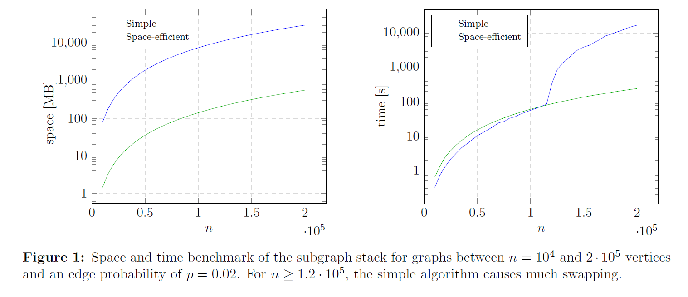
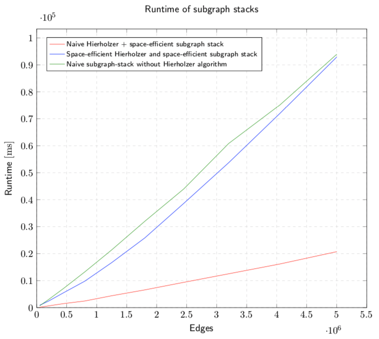

<h1 align="center">
  <br>
  Space-Efficient
  <br>
  Algorithms
  <br>
</h1>

<div align="center">

[](https://travis-ci.org/thm-mni-ii/sea) [](https://www.gnu.org/licenses/gpl-3.0) [](https://coveralls.io/github/thm-mni-ii/sea?branch=master) [](https://sonarcloud.io/dashboard?id=thm-mni-ii_sea) [](https://sonarcloud.io/dashboard?id=thm-mni-ii_sea)

</div>

SEA is a project to research and implement an open C++ library for Space-Efficient (Graph) Algorithms (SEA).
Besides the running time of algorithms, their space requirements cause a problem if dealing with huge
data sets or executing them on tiny devices where memory is heavily limited. Therefore, we want to provide algorithms and data structures to tackle this problem by treating space as a scarce resource.

## Table of Contents
* [Motivation](#motivation)
* [Algorithms and Data Structures](#algorithms-and-data-structures)
    * [Algorithms](#algorithms)
    * [Data Structures](#data-structures)
* [Build](#build)
* [Using the Library](#using-the-library)
* [Project Structure](#project-structure)
* [Research](#research)
* [License](#license)
* [Acknowledgments](#acknowledgments)

## Motivation
Space-efficient algorithms in practice are justified by two main arguments.
The first one is that due to memory limitation of a real computer a space-efficient algorithm
runs on instances where a non space-efficient algorithm would crash due to out of memory errors.
This is especially interesting where all cores of a computer should be used
and multiple algorithms compete for the available memory.
The second reason is that space-efficient algorithms can run faster on huge instances
because they use less memory and therefore cause less cache faults.
(A cache fault occurs when a system must 
move some of the data stored in the memory to a slower one, i.e., 
from the L1/L2/L3 cache of the CPU to the RAM or from the RAM to the disc drive.)

We now show these two points on an example.
Assume we need to compute an Eulerian tour in an outerplanar graph.
Without going into detail, we use the Hierholzer algorithm where
one key step of the algorithm is the creation of
 recursive graph instances.
The first step to make the algorithm space-efficient is to handle the recursive
graph instances with a subgraph stack.
We have implemented a folklore algorithm and a space-efficient version of it and
run tests to measure the running time and the space requirements of both algorithms.

The next image shows the space requirements of the creation of subgraph instances
using a space-efficient subgraph stack (blue line) and a naive subgraph stack, which
creates subgraphs instances by copying vertices and edges of the original graph that
remain in the subgraph. We run the test on a machine with 4gb of RAM and a small swap memory.
Note that the naive subgraph stack did not run on large instances because
it crashed after running out of memory, while the space-efficient subgraph stack
could still run.

<div align="center">



</div>

Next we show the runtime results of the computation of Eulerian tours mentioned above.
The green line shows the runtime of just the creation of the recursive graph instances
without even running Hierholzer algorithm on them.
The red line shows the runtime of a naive Hierholzer algorithm that uses a space-efficient subgraph stack,
i.e., a space-efficient version to create subgraphs.
The blue line shows the runtime of a space-efficient Hierholzer algorithm that uses
a space-efficient subgraphs stack.

<div align="center">



</div>

Note that space-efficient algorithms neither guarantee better time performance in general
nor does over optimization of memory requirements leads to better running times.
As often in life, a reasonable mix does the trick.

## Algorithms and Data Structures
This section gives you a brief overview over the implemented algorithms and data structures. For a detailed documentation click on an algorithm.
For some data structures and algorithms we also provide a folklore implementation that we use to compare the memory consumption and runtime efficiency.

### Algorithms
| Algorithm             | Runtime        | Memory (bits)           |  Details                            |
| --------------------- | -------------- | ----------------------- | :---------------------------------: |
| Depth First Search    | O(n+m)         | O(n+m)                  | [here](docs/nplusm-bit-dfs.md)      |
| Depth First Search    | O(n+m)         | O(n log(log n))         | [here](docs/nloglogn-bit-dfs.md)    |
| Depth First Search    | O((n+m) log n) | O((log(3)+ε) n)         | [here](docs/n-bit-dfs.md)           |
| Reverse DFS           | O(n+m)         | O(n log(log n))         | [here](docs/reverse-dfs.md)         |
| Breadth First Search  | O(n+m)         | O(n)                    | [here](docs/n-bit-bfs.md)           |
| Cut-Vertex            | O(n+m)         | O(n+m)                  | [here](docs/cut-vertex-iterator.md) |
| Biconnected-Component | O(n+m)         | O(n+m)                  | [here](docs/bcc-iterator.md)        |
| Outerplanar Detection | O(n log(log n))| O(n)                    | [here](docs/outerplanar.md)         |

### Data Structures
* InitializedArray: An array consisting of fields that in total can be initialized with an user defined value in constant time by using O(1) computer words. The array provides constant time access (read/write) to fields.
* Graph(G = {V, E}): An adjacency list graph representation that occupies O((n + m) log n) bits.
* Bitset: A bitset of n bits that supports access in O(1) time and occupies O(n) bits.
* AVL tree: A self-balancing binary tree with O(log(n)) time for search, insertion and removal of a node.
* [Choice Dictionary](docs/choice-dictionary.md): A bitset that supports a *choice* operation in O(1) time that returns the position of a bit set to 1. The choice dictionary occupies O(n) bits.
* [Rank-Select](docs/rank-select.md): A bit sequence that supports the operations *rank(k)* and *select(k)* in O(1) time and occupies O(n) bits. *rank(k)* returns the number of set bits up to index k, and *select(k)* returns the index of the k-th set bit.
* [Ragged Dictionary](docs/ragged-dictionary.md): A set of n/log(n) key-value tuples with O(log(log(n))) time for *get*, *insert* and *remove* operations. The ragged dictionary occupies O(n) bits.
* Static-Space Storage: A sequence of n bit packs of variable size that can be accessed in O(1) time and occupies O(n + N) bits. N is the total usable size of the static-space storage.
* [Subraph Stack](docs/subgraph-stack.md): Initialized with an n-vertex m-edge graph the stack allows to remove vertices and edges and provides a resulting graph using O(n + m) bits.

## Build
1. Install CMake and a C++ compiler for your specific operating system.
2. Build a make file for your system by using CMake -> `cmake .`
3. Build the artifacts by executing make -> `make`

Now, the `include` folder contains the necessary header files and the `lib` folder contains the build library.

If you encounter any bugs, missing or misleading documentation, do not hesitate to create an [issue ticket](https://github.com/thm-mni-ii/sea/issues/new).

## Using the Library
- Copy the `include/sealib` folder into your own project's include path.
- Copy the `lib/libsealib.so` file into your own project's library path. Make sure that the environment variable `LD_LIBRARY_PATH` also points there, or else the shared library won't be found.
- Include the header files you want to use in your code.
- Compile with correct `-I` and `-L` flags, and use `-std=c++11`.

### Usage example
```cpp
#include <vector>
#include <sealib/_types.h>
#include <sealib/iterator/dfs.h>
#include <sealib/graph/graphcreator.h>

using namespace Sealib;

bool reachable(DirectedGraph &g, uint64_t a, uint64_t b) {
    bool ret = false;
    std::vector<bool> started(100);
    std::vector<bool> done(100);
    DFS::nloglognBitDFS(g,
                        [&](uint64_t u) {
                            started[u]=1;
                            if (u == b && started[a] && !done[a]) {
                                ret = true;
                            }
                        },
                        DFS_NOP_EXPLORE, DFS_NOP_EXPLORE,
                        [&](uint64_t u) { done[u]=1; });
    return ret;
}

int main(void) {
    DirectedGraph g = GraphCreator::kOutdegree(100, 30);
    return reachable(g, 10, 25);
}
```
Compile with:
```sh
clang++ -I<include-path> -L<libary-path> -std=c++11 -o reachable reachable.cpp -lsealib
```
Run the executable: 
```sh
export LD_LIBRARY_PATH=<library-path>
./reachable
```

## Project Structure
```bash
.
├── CMakeLists.txt  # CMake build script
├── LICENSE         # Licence description
├── README.md       # You are reading this file now
├── third-party     # Third party libraries
├── include         # The library's header files (*.h)
├── src             # The library's source files (*.cpp)
├── src-view        # The source files for the visualization (*.cpp)
├── test            # The test files
├── lib             # The library files
└── bin             # Executable files to test the project
```

## Research
We publish most of our research on [arXiv.org](https://tinyurl.com/ybxbb77z).

* Sorting and Ranking of Self-Delimiting Numbers with Applications to Tree Isomorphism [Full Version](https://arxiv.org/abs/2002.07287)
* Space-Efficient Vertex Separators for Treewidth [Full Version](https://arxiv.org/abs/1907.00676)
* Extra Space during Initialization of Succinct Data Structures and Dynamical Initializable Arrays [MFCS 2018](https://dblp.uni-trier.de/db/conf/mfcs/mfcs2018.html): 65:1-65:16 | [Full Version](https://arxiv.org/abs/1803.09675)
* Linear-Time In-Place DFS and BFS on the Word RAM [CIAC 2019](http://easyconferences.eu/ciac2019/accepted.html) | [Full Version](https://arxiv.org/abs/1803.04282)
* A Space-Optimal c-Color Choice Dictionary [ISAAC 2018](http://isaac2018.ie.nthu.edu.tw/wp-content/uploads/2018/09/isaac2018_accepted.html): 66:1-66:12 | [Full Version](http://drops.dagstuhl.de/opus/volltexte/2018/10014/)
* Space-Efficient Biconnected Components and Recognition of Outerplanar Graphs [MFCS 2016](http://mfcs.ki.agh.edu.pl/accepted.shtml): 56:1-56:14 | [Full Version](http://drops.dagstuhl.de/opus/volltexte/2016/6468/)
* Space-Efficient Basic Graph Algorithms [STACS 2015](http://wwwmayr.in.tum.de/konferenzen/STACS2015/): 288-301 | [Full Version](http://drops.dagstuhl.de/opus/volltexte/2015/4921/)

## License
Licensed under the MIT licence. For detailed license information look inside the [LICENSE](LICENSE) file.

## Acknowledgments
Funded by the Deutsche Forschungsgemeinschaft (DFG, German Research Foundation) – [379157101](http://gepris.dfg.de/gepris/projekt/379157101?language=en).
